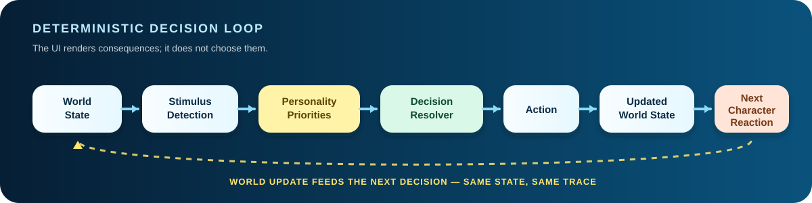

# Personality Physics

> **What if characters followed personalities instead of scripts?**
>
> A deterministic character simulation where the same world state produces the same chain of decisions — until one variable changes.


<p align="center">
  <strong>Bikini Bottom: Personality Physics</strong> is the original hackathon skin for the engine.
  The reusable product concept is <strong>Personality Physics</strong>.
</p>

<p align="center">
  <a href="https://kristinelio.github.io/bikini-bottom-personality-physics/"><strong>Launch the live demo</strong></a>
  ·
  <a href="ARCHITECTURE.md">Read the architecture</a>
  ·
  <a href=".github/workflows/engine-tests.yml">View the proof tests</a>
</p>

---

## Problem

Interactive character demos often look dynamic while still being controlled by hidden scripts: press a button, play a pre-authored sequence, reset.

That makes the story entertaining, but it makes the underlying system difficult to defend technically. If the characters are supposed to have personalities, the interesting question is not _what animation should play?_ It is:

> **Given the same world state, what would each character choose — and why?**

Personality Physics treats storytelling as a deterministic decision problem instead of a sequence of authored scenes.

---

## Concept

Each character has explicit priorities. Props and other characters become stimuli. Geometry affects which motivations are active. The engine scores competing motivations, chooses actions, updates the world, and feeds the new state into the next reaction.

The core rule is deliberately simple:

**Same world state → same ordered decision trace.**

Change one input and the chain can branch.

The Bikini Bottom theme was chosen for the hackathon because familiar personalities make emergent behavior immediately legible: people already understand that Plankton wants the formula, Mr. Krabs cares about money, SpongeBob is loyal, Patrick is impulsive, and Squidward protects his clarinet.

The engine itself is theme-agnostic. A future public-facing skin can use original characters while reusing the same resolver, geometry, fingerprints, tests, and animation pipeline.

---

## 20-second demo

The main judge path is directed like a short experiment:

1. **SETUP** — same characters, same positions, same formula.
2. **ROUND 1** — Plankton targets the formula; SpongeBob and Mr. Krabs keep defenders active.
3. **+1 VARIABLE** — everything freezes and only **money** is added.
4. **ROUND 2** — Patrick reacts, Mr. Krabs reprioritizes, SpongeBob follows the commotion, defenders fall to zero, and Plankton gets the opening.
5. **PROOF** — the user lands directly on the determinism controls.

The final frame summarizes the experiment:

> **SAME PERSONALITIES. ONE NEW VARIABLE. DIFFERENT EPISODE.**

The demo is cinematic, but its decisions are produced by the same engine used in Director Mode.

---

## How the engine works

The simulation core exposes a UI-independent contract:

```js
resolve(worldState)
```

It returns:

```js
{
  actions,          // ordered semantic decisions
  outcome,          // final episode result
  scores,           // competing motivation scores
  decisions,        // selected targets / thresholds
  resultingState    // cloned world after semantic actions
}
```

There is no DOM access, animation timing, or randomness inside the resolver.

A simplified example:

```text
money appears
→ Mr. Krabs: money_priority > formula_priority
→ Krabs leaves formula defense
→ SpongeBob: follow_authority > protect
→ active defenders = 0
→ Plankton: opportunism fires
→ formula stolen
```

That separation is the most important architectural decision in the project: the browser visualizes the decisions; it does not choose them.

---

## Determinism

The product exposes two fingerprints:

- **Setup fingerprint** — hash of the canonical world state.
- **Trace fingerprint** — hash of the ordered action trace plus outcome.

The user can press:

- **↻ RUN SAME SETUP AGAIN**
- **🦋 CHANGE ONE VARIABLE**

The first must reproduce the same setup hash, trace hash, and outcome. The second should change the setup fingerprint and may create a different action trace and result.

Automated tests verify the public claims:

```text
same state → same ordered trace
money absent → Krabs defends formula
money present → money priority wins
Patrick path near clarinet → Squidward reacts
clarinet moved away → Squidward does not react
identical states → identical fingerprints
one changed input → changed setup + trace
```

Run them locally:

```bash
npm test
```

The repository also runs the deterministic engine suite in GitHub Actions.

---

## Motivation Collision

Director Mode proves the engine is reusable beyond the canned judge path.

The standout setup places:

- money near Mr. Krabs,
- the formula near Plankton,
- the clarinet near Squidward,
- Patrick between the stimuli.

Pressing **ACTION** does not select a special scripted ending.

The resolver evaluates actual geometry and competing priorities:

```text
money attracts Patrick
→ Patrick's movement path crosses the clarinet safety radius
→ Squidward protects the clarinet
→ Krabs chooses money over formula defense
→ no active defenders remain
→ Plankton exploits the opening
```

Move the clarinet away and Squidward drops out of the chain. That behavior is covered by an automated test.

---

## Architecture



```text
World State
    ↓
Stimulus Detection
    ↓
Personality Priorities
    ↓
Decision Resolver
    ↓
Action
    ↓
Updated World State
    ↓
Next Character Reaction
```

The codebase mirrors that separation:

| Module | Responsibility |
| --- | --- |
| `engine.js` | Pure deterministic state evaluation and ordered action resolution |
| `personalities.js` | Character traits, explicit weights, and rule descriptions |
| `world.js` | Actors, props, distance, proximity, path geometry, signatures, hashing |
| `scenarios.js` | Reproducible input-state factories; no outcomes |
| `ui.js` | DOM helpers only |
| `animations.js` | Movement and presentation timing |
| `app.js` | Browser orchestration and wiring |

See **[ARCHITECTURE.md](ARCHITECTURE.md)** for the deeper technical walkthrough.

---

## Tech

The project intentionally stays lightweight.

- Vanilla JavaScript ES modules
- HTML + CSS
- Deterministic rule engine with explicit personality weights
- Euclidean distance + point-to-segment path checks
- Canonical state signatures + FNV-style hashing
- Node.js built-in `node:test`
- GitHub Actions CI
- GitHub Pages deployment workflow
- Local SVG character assets
- No runtime framework
- No simulation dependency on the DOM

That keeps the important part of the system readable to a technical judge in a few minutes.

---

## Lessons learned

**1. Emergence needs visible causality.**  
A result feels random if the user cannot see which stimulus activated which rule. The Personality X-ray layer was added so the system can briefly expose the winning decision.

**2. Determinism is stronger when the user can challenge it.**  
“Same setup = same outcome” is only a slogan until someone can replay the exact world and compare trace fingerprints.

**3. Scenarios should define inputs, not endings.**  
The Judge Demo and Motivation Collision setup now create starting worlds only. The engine produces the outcome.

**4. Presentation and simulation should be separate systems.**  
Cinematic pacing improved dramatically once animation became a consumer of semantic actions rather than part of the decision logic.

**5. Familiar characters are useful for explanation, not for the product boundary.**  
Bikini Bottom makes personality-driven behavior intuitive for a hackathon audience. The reusable portfolio concept is the underlying Personality Physics engine.

---

## Live demo

**Production target:**  
https://kristinelio.github.io/bikini-bottom-personality-physics/

The repository includes a GitHub Pages workflow that publishes the static application from `main`.

If GitHub Pages is unavailable for this private repository under the current GitHub plan, the same static build can be published unchanged to a public portfolio mirror or another static host.

### Local run

Because the app uses ES modules, serve the repository over HTTP rather than opening `index.html` directly.

For example:

```bash
python -m http.server 8000
```

Then open:

```text
http://localhost:8000
```

### Theme note

**Personality Physics** is the original simulation engine and portfolio concept. **Bikini Bottom: Personality Physics** is a fan-made hackathon demonstration used to make the behavior immediately understandable. Character names and associated fictional properties belong to their respective rights holders; the simulation code and engine architecture in this repository are original project work.
